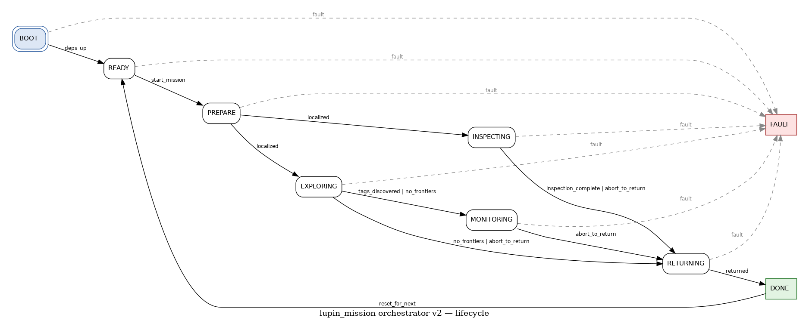
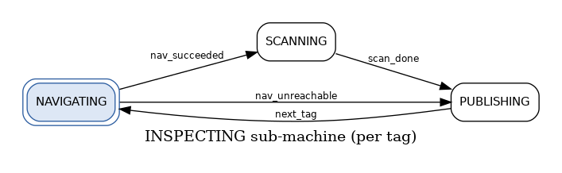

# lupin_mission (v2)

Mission orchestrator for the Lupin / FloraNova digital twin. Drives the
MIRTE Master through tag-based inspection routines via Nav2 + the
greenhouse bridge, and broadcasts every observation as a typed ROS 2
message so downstream consumers (web Mission tab, future digital-twin
publishers, …) can react in real time.

## Architecture

Hierarchical state machine via the
[`transitions`](https://github.com/pytransitions/transitions) library —
top-level lifecycle plus a sub-machine for each mission type.

```
BOOT ──► READY ──► PREPARE ──► INSPECTING ──► RETURNING ──► DONE
                       │                                      │
                       └──────► (FAULT) ◄─────────────────────┘
                                                              │
                                                              └──► READY
                                                                   (next mission)

PREPARE:    LOCALIZING  (covariance gate; map loading is a TODO)
INSPECTING: NAVIGATING → SCANNING → PUBLISHING (per tag, in sequence)
```



- `INSPECTING` is the per-tag flow. NAVIGATING issues NavigateToPose,
  SCANNING calls the greenhouse bridge, PUBLISHING is the named gate
  (the `Observation` is actually published from SCANNING / nav-failure
  paths — PUBLISHING is the single hook for future digital-twin work).

  

- `PREPARE` is currently `LOCALIZING` only. A future `MappingMission`
  will add an exploration child.
- **Pause** and **E-stop** are *flags*, not states — they freeze the
  active sub-state without altering the lifecycle. `/mission/resume`
  is the only thing that unblocks. E-stop release does NOT auto-resume.
- `FAULT` is reachable from anywhere and is terminal (rejects future
  `/mission/start` requests). The node stays alive for introspection.

## Quickstart

The orchestrator no longer auto-runs on bringup — it idles in `READY`
until you invoke `/mission/start`.

Install the runtime dependency that doesn't ship in rosdep:

```bash
pip install 'mdp-greenhouse>=1.0.7,<2' 'transitions>=0.9'
```

Then bring up the four pieces in any order:

```bash
# Terminal 1 — Greenhouse Gazebo world (sim only)
ros2 launch lupin_bringup greenhouse.launch.py

# Terminal 2 — Greenhouse bridge (the sensor service)
ros2 launch lupin_greenhouse_bridge greenhouse_bridge.launch.py

# Terminal 3 — Nav2 (localisation + navigation lifecycle stack)
ros2 launch lupin_navigation nav2.launch.py

# Terminal 4 — The orchestrator (idles in READY)
ros2 launch lupin_mission mission.launch.py
```

Start an inspection mission:

```bash
ros2 service call /mission/start lupin_msgs/srv/StartMission \
  "{mission_type: 'InspectionMission', tag_sequence: []}"
```

Empty `tag_sequence` → visit every tag from `tag_locations.json` in
numeric-string order. Pass an explicit list to visit a subset:

```bash
ros2 service call /mission/start lupin_msgs/srv/StartMission \
  "{mission_type: 'InspectionMission', tag_sequence: ['1','5','12']}"
```

Watch the mission live:

```bash
ros2 topic echo /mission/state                # 5 Hz status snapshot
ros2 topic echo /floranova/observations       # one per tag completion
```

Operator controls (all `std_srvs/Trigger`):

```bash
ros2 service call /mission/pause          std_srvs/srv/Trigger
ros2 service call /mission/resume         std_srvs/srv/Trigger
ros2 service call /mission/abort          std_srvs/srv/Trigger
ros2 service call /mission/skip_current   std_srvs/srv/Trigger
```

## ROS interfaces

| Direction | Name | Type | Notes |
|---|---|---|---|
| Subscribe | `/e_stop_state` | `std_msgs/Bool` | `true` = engaged. Engaging cancels in-flight goals + freezes mission. Release does NOT auto-resume. |
| Subscribe | `/amcl_pose` | `geometry_msgs/PoseWithCovarianceStamped` | Latched (TRANSIENT_LOCAL). Used by the LOCALIZING gate. |
| Action client | `navigate_to_pose` | `nav2_msgs/action/NavigateToPose` | Used for both inspection nav and RETURNING dock. |
| Service client | `/greenhouse_bridge/get_tag_reading` | `lupin_msgs/srv/GetTagReading` | Bridge call from SCANNING. |
| Service client | `/perception/confirm_tag` | `lupin_msgs/srv/ConfirmTag` | Pre-bridge visual gate. Only created when `require_visual_confirmation: true`. |
| Publish | `/mission/state` | `lupin_msgs/MissionState` | 5 Hz, RELIABLE+TRANSIENT_LOCAL depth 1 (latched). |
| Publish | `/floranova/observations` | `lupin_msgs/Observation` | Event-driven, RELIABLE+TRANSIENT_LOCAL depth 50 — late subscribers see the mission so far. `tag_pose_in_map` is populated from the latest AMCL snapshot on `STATUS_OK` only; on UNREACHABLE/SCAN_FAILED/SKIPPED the field is left zero (`orientation.w==0`) — that's the "missing" sentinel the digital-twin consumer expects. |
| Service | `/mission/start` | `lupin_msgs/srv/StartMission` | Begin a mission. Rejected if FAULT or already running. |
| Service | `/mission/pause` | `std_srvs/Trigger` | Cancels in-flight goal, freezes progress. |
| Service | `/mission/resume` | `std_srvs/Trigger` | Clears pause; rejects while E-stop engaged. |
| Service | `/mission/abort` | `std_srvs/Trigger` | Marks remaining tags SKIPPED (one observation each), routes to RETURNING. |
| Service | `/mission/skip_current` | `std_srvs/Trigger` | Marks current tag SKIPPED, advances. INSPECTING only. |

## Approach poses (per-tag goal construction)

`tag_locations.json` gives each tag an `(x, y)` only — no orientation, no
indication of which side the camera should approach from. The orchestrator
synthesises the missing yaw from the *table* the tag belongs to.

For each NavigateToPose:

1. Pick the nearest table by bbox-centre distance (lex tiebreak — deterministic).
2. The tag's outward normal = unit vector from that table's centre to the tag.
3. Goal pose = `tag + standoff * normal`. Goal yaw points back at the tag, so
   the front-facing camera frames the AprilTag head-on.
4. If geometry can't run (no tables loaded, tag at table centre), fall back
   to the global `approach_yaw` parameter and skip the standoff.

The log line on every nav goal surfaces `derived_from=geometry|override|fallback`
plus the picked `table=<id>` and `standoff=<m>`, so operators can read the
chosen path off the orchestrator's stdout.

### Per-tag overrides

When the geometric heuristic doesn't capture reality — leaf occlusion,
shelf-mounted tag, glare from a window — drop a partial or full override
into the `approach_overrides_file` YAML. Sim leaves the file empty;
hardware operators populate it without rebuilding ROS code.

```yaml
overrides:
  "12":                       # partial override: tighter standoff
    standoff: 0.35            # geometry yaw + position kept
  "17":                       # full override: bypass geometry entirely
    goal_x: 4.10
    goal_y: 5.83
    yaw: 3.14
    standoff: 0.4
```

Any subset of `goal_x`/`goal_y`/`yaw`/`standoff` is allowed — missing
fields fall through to the geometry result. Standoff is clamped to
`[0.2, 1.5]` m.

### Visual confirmation (hardware gate)

When `require_visual_confirmation: true`, the orchestrator calls
`/perception/confirm_tag` at the start of SCANNING **before** the bridge
call. The `MissionState.mission_phase` field reads `CONFIRMING` while the
service call is in flight; if perception responds `detected: true`, the
flow proceeds to the bridge call as usual. On `detected: false` or a
`visual_confirmation_timeout_s` lapse, the tag is marked `SCAN_FAILED`
with the perception's `error_message` (or `confirm_timeout`) and the
mission advances. The perception node itself is **not** part of this
package — see `lupin_msgs/srv/ConfirmTag.srv` for the contract a future
detector implementation must satisfy.

This repository already includes `lupin_perception`, a small vision package
that launches `apriltag_ros` plus the `tag_annotator` node to publish
`/camera/image_raw_boxed` with AprilTag detections drawn for debugging.
The `/perception/confirm_tag` gate is still a future integration point.

Sim leaves the gate off (`false`) and the bridge oracle path is used directly.

### Per-leg AMCL drift gate

Before each NavigateToPose the orchestrator re-checks `_max_diag_var()`
against `nav_localization_cov_threshold`. The start-of-mission gate
catches "we never localised" — this gate catches drift accumulated over
a long patrol (kidnap, low-feature aisle). On gate failure: no goal is
sent, the tag is marked `UNREACHABLE` with `status_detail=amcl_drift_var=<value>`,
and the mission advances.

## Failure policy

| Event | Effect | Observation emitted? |
|---|---|---|
| Nav2 ABORTED / CANCELED / `nav_timeout_s` | Retry until `nav_max_attempts` reached. | Only on the final failed attempt: status `UNREACHABLE`, `tag_reading` empty. |
| AMCL drift > `nav_localization_cov_threshold` (per-leg) | Refuse goal, mark `UNREACHABLE`, advance. | `UNREACHABLE`, `status_detail = amcl_drift_var=<value>`. |
| Visual confirm `detected=false` / `visual_confirmation_timeout_s` | Mark `SCAN_FAILED`, advance. | `SCAN_FAILED`, `status_detail` = perception's `error_message` or `confirm_timeout`. |
| Bridge `STATUS_UNKNOWN_TAG` / exception / `scan_timeout_s` | Mark `SCAN_FAILED`, advance. | `SCAN_FAILED`, `status_detail` = bridge error / `scan_timeout`. |
| `/mission/skip_current` | Cancel current goal, advance. | `SKIPPED`, `status_detail = skipped_by_operator`. |
| `/mission/abort` | Cancel current goal, mark all remaining `SKIPPED`, route to RETURNING. | One `SKIPPED` per remaining tag. |
| `/e_stop_state = true` mid-mission | Cancel in-flight goal, freeze. | None — observations resume after `/mission/resume`. |
| Nav2 fail in RETURNING | Log warning, transition to DONE anyway. | None. |
| `dependency_timeout_s` reached in BOOT | Transition to FAULT. | None. |
| `localization_timeout_s` reached in PREPARE | Transition to FAULT. | None. |

## Parameters

```yaml
mission_orchestrator:
  ros__parameters:
    # Dependencies
    nav_action_name: navigate_to_pose
    bridge_service_name: /greenhouse_bridge/get_tag_reading
    estop_topic: /e_stop_state
    amcl_pose_topic: /amcl_pose
    dependency_timeout_s: 30.0

    # Localization (PREPARE)
    map_yaml_path: ""              # if empty, assumes Nav2 already has a map loaded
    localization_timeout_s: 15.0
    localization_covariance_threshold: 0.25

    # Inspection
    tag_sequence: []               # empty = all tags from tag_locations.json
    approach_yaw: 0.0              # fallback heading when geometry can't run
    approach_standoff_m: 0.5       # distance from tag along its outward normal
    approach_overrides_file: ""    # optional per-tag YAML; see "Approach poses" below
    nav_timeout_s: 60.0
    nav_max_attempts: 2            # total attempts, NOT retries
    nav_localization_cov_threshold: 0.25  # max diag(x,y,yaw); refuse goal if AMCL drifted past this
    scan_timeout_s: 5.0
    require_visual_confirmation: false    # hardware-only gate; sim leaves false
    visual_confirmation_service: /perception/confirm_tag
    visual_confirmation_timeout_s: 3.0

    # Returning (stub)
    dock_pose: [0.0, 0.0, 0.0]     # x, y, yaw — TODO: real dock-finding
    dock_timeout_s: 60.0

    # Publishing
    state_publish_rate_hz: 5.0
    mission_id_prefix: "lupin"     # mission_id = f"{prefix}-{uuid4().hex[:8]}"
    frame_id: "map"
```

## Tests

End-to-end behavioural tests run against in-process fakes (no real
Nav2 / bridge / AMCL / e-stop publisher needed):

```bash
cd ~/ros2_ws
colcon test --packages-select lupin_mission --event-handlers console_direct+
colcon test-result --verbose --test-result-base build/lupin_mission
```

Eight cases cover the lifecycle happy path, mid-mission start rejection,
pause/resume, abort, skip_current, retry → UNREACHABLE, E-stop preempt
with manual resume, and multi-mission within a single node lifetime.

## Regenerating the state diagram

```bash
cd ~/ros2_ws/src/lupin/lupin_mission
python3 scripts/generate_state_diagram.py docs/state_machine.png
```

Requires `pygraphviz` and the `dot` binary (`apt install graphviz`).
