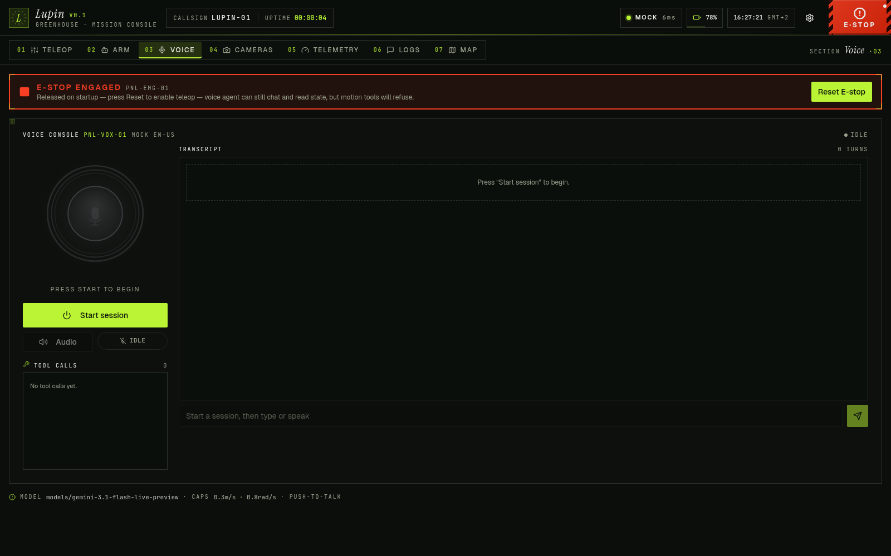

# lupin_web

Browser-based HMI for the MIRTE Master. Vite + React + Tailwind + shadcn/ui
frontend served on port `8090`, talking to the rosbridge_websocket already
running on port `9090` of the course image. **Coexists with the course web
interface — does not replace it.** If `lupin_web` crashes, the course UI is
still up.



*The Voice tab in `?mock=1` mode — same layout in every screen: top bar with
mock/rosbridge pill, battery, clock, settings, and the persistent full-height
E-STOP. Captured on the `feature/voice-tool-expansion` branch with no robot
attached.*

## Surfaces

A persistent top bar (logo · rosbridge pill · battery pill · clock · settings
gear · permanent E-STOP) wraps seven tabs:

- **Teleop** — two virtual joysticks (left = linear x/y, right = angular z),
  live Twist readout, speed-scale slider, mirrored stop button.
- **Arm** — per-joint sliders for the 4-DOF Hiwonder arm (shoulder pan / lift,
  elbow, wrist) plus the gripper jaw, calling
  `mirte_msgs/srv/SetServoAngleWithSpeed`. Loud "RANGE UNVERIFIED" badge on
  joints whose mechanical limits haven't been ground-truthed yet.
- **Voice** — push-to-talk console wired to Google's Gemini Live API. The
  model has a 14-tool surface covering teleop, navigation, manipulation,
  named-location memory, telemetry reads, and software E-stop. Mock session
  runs without an API key. See **Voice assistant** below.
- **Cameras** — MJPEG stream from `web_video_server` with FPS counter,
  reload, fullscreen, friendly placeholder when no stream.
- **Telemetry** — Lidar canvas (top-down), IMU (roll/pitch/yaw + ω bars),
  Odometry pose+twist, Battery + voltage sparkline, Arm joints, System
  placeholder.
- **Logs** — `/rosout` live tail with severity filter, node filter, search,
  pause/clear, auto-scroll toggle, capped at 500 rows.
- **Map** — live SLAM occupancy grid (subscribes `/map`), robot pose via
  `ROSLIB.TFClient` against the `map → base_link` transform, latest Nav2
  plan (`/plan`) as a chartreuse polyline, and click-and-drag to publish a
  `geometry_msgs/PoseStamped` to `/goal_pose`. AprilTag overlay still TODO.

## Engineering notes

- **One ROS context.** A single `RosProvider` owns the rosbridge connection,
  reconnects with exponential backoff, exposes `useTopic` / `usePublisher`
  hooks. No component creates its own `ROSLIB.Ros`.
- **Mock mode.** `?mock=1` swaps the provider for a synthetic-data source —
  every surface works without a robot. The bar for "demoable" is a clean
  walkthrough in mock mode.
- **E-STOP is permanent furniture, not a button.** A red full-height bar on
  every screen. Triggers on press, `beforeunload`, rosbridge disconnect, and
  (toggleable via Settings → Safety) `visibilitychange` / `blur`. The voice
  agent can trip it via the `engage_estop` tool — that path uses a dedicated
  `voice-agent` reason so the audit trail distinguishes it from a human press.
  While active, gates all `useCmdVel` publishes and heartbeats zero-Twist at
  10 Hz. Reset is manual.
- **No sign hacks.** The app publishes vanilla REP-103 Twists to whatever
  topic Settings declares (default `/cmd_vel`). The hardware quirk where
  `+linear.x` moves real Mirte backward is fixed downstream by a separate
  ROS adapter node, not in here.
- **TypeScript message contracts.** `src/types/ros.ts` defines the message
  layouts we subscribe to; rosbridge JSON is cast directly.
- **Throttled rendering.** High-frequency feeds (Lidar, IMU) write to refs
  and use `useThrottledRender` / `useAnimationLoop` so we don't re-render
  the whole tree on every message.

## Layout

```
lupin_web/
├── package.xml          ament_python package
├── setup.py             installs only ROS metadata, never node_modules/dist
├── lupin_web/           Python package (room for future ROS nodes)
└── web/                 Vite + React + TS + Tailwind + shadcn frontend
    ├── COLCON_IGNORE    keeps colcon out of this directory entirely
    └── src/
        ├── App.tsx           layout shell + tabs + providers
        ├── main.tsx
        ├── index.css         dark-default theme tokens
        ├── types/ros.ts      message-layout contracts
        ├── lib/
        │   ├── ros.tsx       RosProvider, useTopic, usePublisher
        │   ├── estop.tsx     EStopProvider, useCmdVel, auto-stop triggers
        │   ├── settings.ts   localStorage-backed settings store
        │   ├── mock.ts       synthetic-data generators
        │   ├── throttle.ts   useThrottledRender / useAnimationLoop / Ring
        │   └── utils.ts      cn helper
        ├── lib/voice/
        │   ├── session.tsx   useVoiceSession — owns WS lifecycle + tool dispatch
        │   ├── gemini-live.ts Bidi WS client (setup / mic / tool-response)
        │   ├── tools.ts      function declarations sent in BidiSetup
        │   ├── audio.ts      MicCapture + AudioPlayer (16 kHz / 24 kHz)
        │   ├── mock.ts       scripted offline session
        │   └── types.ts      wire-format types
        ├── components/
        │   ├── TopBar.tsx · ConnectionPill · BatteryPill · ClockPill
        │   ├── EStopButton.tsx · SettingsDrawer.tsx
        │   ├── views/        Teleop / Arm / Voice / Cameras /
        │   │                 Telemetry / Logs / Map
        │   ├── widgets/      Joystick / TwistReadout / LidarCanvas /
        │   │                 ImuCard / OdometryCard / ArmJointsCard /
        │   │                 BatteryCard / Sparkline / CameraStream /
        │   │                 MapCanvas / VoiceOrb / SystemCard
        │   └── ui/            inlined shadcn primitives
        └── ...
```

`web/node_modules/`, `web/dist/`, and `web/dist-node-ts/` are gitignored at
the package root.

## Dev workflow

On any machine with Node 20+ (laptop or robot):

```bash
cd web/
npm install                       # first time + after dep changes
npm run dev                       # Vite dev server on 0.0.0.0:8090
npm run dev -- --mode mock        # (or just append ?mock=1 to the URL)
```

Open `http://<host>:8090` from any device on the same network. With
`?mock=1` the app runs against synthetic data and is fully demoable
offline.

The page picks up its rosbridge URL from `ws://<window.location.hostname>:9090`
by default; the Settings drawer (gear icon) lets you override that and every
topic name. All overrides persist to `localStorage`.

## Diagnostic logging

Settings → Diagnostics → "Log outgoing publishes" (or set
`debugPublish: true` in localStorage) prints every published message as
JSON to the console with the topic name. Use this when debugging
rosbridge-side wire-format issues end to end.

## Bringing the HMI up

The HMI is part of `lupin_bringup`'s `hardware.launch.py` — one command
on the laptop brings up Nav2, SLAM, RViz, **and** the HMI. The HMI is on
by default; pass `web:=false` if you don't want it.

```bash
ros2 launch lupin_bringup hardware.launch.py            # HMI + Nav2 + SLAM + RViz
ros2 launch lupin_bringup hardware.launch.py web:=false # no HMI
```

Open `https://<laptop-ip>:8090` once Vite logs "ready in NNN ms".
Browsers warn about the self-signed cert — accept it once per device.
See `lupin_bringup/README.md` for the full flag matrix.

### Standalone (HMI only, no Nav2)

If you just want the HMI without the autonomy stack:

```bash
ros2 launch lupin_web lupin_web.launch.py             # serves dist/ on :8090
ros2 launch lupin_web lupin_web.launch.py mode:=dev   # vite dev server (HMR)
ros2 launch lupin_web lupin_web.launch.py rosbridge:=false  # use external rosbridge
```

The `preview` mode (default) requires `npm run build` to have produced a
`dist/` artefact. The launch file wraps `npm run preview` / `npm run dev`
with the flags pinned, so `npm install` must have been run once.

### Robot-side legacy unit (rarely useful)

`systemd/lupin-web.service` + `scripts/install-systemd.sh` are kept for
offline / standalone teleop where there's no laptop in the loop. Running
both robot- and laptop-side HMIs at once means two rosbridges fighting
for the same topics — pick one.

```bash
# on the robot, if you really want the HMI on the Pi
sudo ~/ros2_ws/src/lupin/lupin_web/scripts/install-systemd.sh
```

Adds the rosbridge JSON-encoding load back to the Pi (the whole point of
the laptop offload was to remove it), so don't reach for this unless
you're working without a laptop.

## Voice assistant

The Voice tab opens a single bidirectional WebSocket directly from the browser
to **Gemini 3.1 Flash Live** (Google AI Studio). One stream carries mic audio
in (16 kHz mono PCM-16, 50 ms frames, base64), and the model's voice + tool
calls + transcripts back. We don't run a separate STT/LLM/TTS pipeline — the
Live API handles all three with native function calling.

### Tool surface

Declared at session start; the model decides which to invoke:

| Tool                    | Effect                                                                  |
|-------------------------|-------------------------------------------------------------------------|
| `drive`                 | Short Twist burst (`linear_x/y`, `angular_z`, `duration_s` ≤ 2 s).      |
| `stop`                  | Zero Twist, immediate.                                                  |
| `rotate`                | Nav2 goal at current pose with yaw shifted by `angle_deg`.              |
| `set_speed_cap`         | Per-session multiplier (0–1) on `voiceMax*` limits.                     |
| `nav_goto`              | `geometry_msgs/PoseStamped` → `goalPoseTopic` (default `/goal_pose`).   |
| `nav_cancel`            | `action_msgs/srv/CancelGoal` on `/navigate_to_pose/_action/cancel_goal`.|
| `nav_goto_named`        | Same as `nav_goto`, resolved from the named-locations map in Settings.  |
| `list_named_locations`  | Returns the live named-locations map (discovery for `nav_goto_named`).  |
| `save_named_location`   | Snapshots the current map→base pose under a name.                       |
| `gripper`               | Open / close jaw via `mirte_msgs/srv/SetServoAngleWithSpeed` (±30°).    |
| `arm_preset`            | `lupin_msgs/srv/SetArmPreset` service call (pending arm-side service).  |
| `engage_estop`          | Trigger software E-stop (reason `voice-agent`); reset stays manual.     |
| `query_state`           | Reads cached `pose`, `battery`, `estop`, `nav_status`. Read-only.       |
| `speak`                 | No action — model just speaks the response.                             |

All motion-producing tools are gated by the same `EStop` provider as Teleop —
when E-stop is active, calls return `ok:false, error:"e-stop active: …"` and
the model is told to back off. `drive` is also clamped per-call to the
`voiceMaxLinearMps` / `voiceMaxAngularRps` settings (with `set_speed_cap`'s
in-memory multiplier on top).

### Setup

1. Get an API key at `aistudio.google.com` (free tier is plenty for the demo).
2. Open Settings → Voice → API key, paste it. Persisted to `localStorage` only.
3. Optional: edit the system prompt, BCP-47 language, named-locations JSON,
   max linear / angular caps, and push-to-talk vs open-mic.
4. Switch to the Voice tab, hit **Start session**, then hold the mic.

Without a key the tab runs a scripted mock session that exercises every code
path (status transitions, transcript rendering, a synthetic `query_state`
tool call) so the UI demos end-to-end offline. The mock harness also kicks in
automatically under `?mock=1`.

### Security tradeoff

The API key is sent as a `?key=` query parameter on the WebSocket — the
browser holds the secret. Acceptable for our LAN-only demo; **do not expose
this UI on the public internet without first wiring the ephemeral-token
broker**. Google's `auth_tokens.create` endpoint is the supported migration
path; a tiny ROS Python node can mint short-lived tokens and the front-end
already has a code seam to swap in the token-fetching client.

### Browser support

- Chromium 121+, Firefox 125+, Safari 17.4+ — anything with `AudioWorklet`
  and `AudioContext({ sampleRate: 16000 })`. The mic capture path falls back
  to runtime resampling if the chosen sample rate is rejected.
- Mic permission is per-origin; on the first session the browser will prompt.
- E-stop fires on `beforeunload` always, and on `visibilitychange` / `blur`
  when **Settings → Safety → Auto E-stop on focus loss** is on (default).
  Disabling that toggle is useful during dev so alt-tabbing doesn't trip the
  stop constantly. Either way, an E-stop flushes pending TTS playback so the
  model doesn't keep talking after the user switches tabs.

## What's not in here yet

- AprilTag overlay on the camera stream
- Voice agent: ephemeral-token broker, persona / wake-word, multi-turn memory
- Voice tool gaps awaiting backend: `scan_apriltags`, `detect_flowers`,
  `get_camera_frame`, `record_observation` — deliberately not stubbed; see
  `lib/voice/tools.ts` to add once the perception/mission node lands.
- `nav_pause` / `nav_resume` — Nav2 has no real pause primitive; deferred
  unless we want to fake it as cancel + remembered goal.
- Authentication, PWA / service worker, multi-user awareness — all deferred
